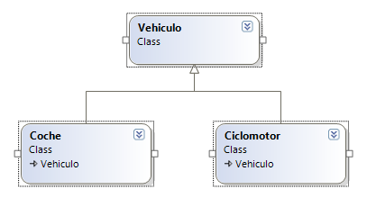
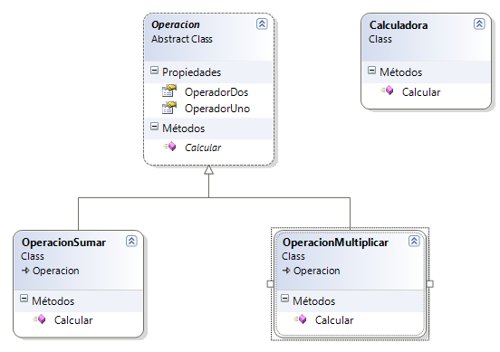

# Parte Ricardo

* [Principio de abierto/cerrado (OCP)](#OCP)
* [Principio de sustitución de Liskov (LSP)](#LSP)

# OCP

<h3>    
El Principio de Abierto-Cerrado, del inglés "The Open-Close Principle (OCP)", nos viene a decir que cualquier entidad software (clases, módulos, funciones, etc.) debe de estar abierta para ser extendida en funcionalidad pero cerrada para ser modificada. Es decir, una clase que cumpla con OCP tiene estas dos características:
</h3>

<pre>

   <h4> 1.- La funcionalidad del módulo puede cambiarse o extenderse
             en base a los cambios que requiera el sistema. </h4>

   <h4> 2.- Extender la funcionalidad de un módulo no implica
             cambios en el código fuente de ese módulo en sí mismo. </h4>
</pre>

---

En este caso, la interfaz [IConductor] es la abstracción que define la clase [Conductor] para conducir un [Vehículo]. Observa que la interfaz se llama [IConductor]en lugar de IVehículo porque el que define la funcionalidad es el [Conductor] mientras que [Vehículo] es únicamente una implementación de esa interfaz. Para implementar el cambio que restringe que un [Conductor] sólo puede conducir vehículos a motor bastaría únicamente con cambiar la implementación de [Vehículo] para justarse a las nuevas necesidades.

Con este diseño, la clase [Conductor] cumple con OCP, pues está abierta a cambios (respecto a conducir vehículos) y cerrado a los cambios (para cambiar el comportamiento de los vehículos, no se necesita cambiar el comportamiento del conductor).Otro tema sería que los cambios que se pidieran no fuesen soportados por la interfaz disponible. Por ejemplo, tener en cuenta vehículos voladores. En este caso los cambios serían a nivel de requerimientos de más alto nivel, por lo que se entiende que no quede más remedio que cambiar la clase [Conductor], la interfaz [IConductor], y evidentemente todas las implementaciones de esta interfa

   

# LSP

<h3>    
El principio de sustitución de Liskov nos dice que si en alguna parte de nuestro código estamos usando una clase, y esta clase es extendida, tenemos que poder utilizar cualquiera de las clases hijas y que el programa siga siendo válido.

</h3>

<pre>

   <h4> 1.- Esto nos obliga a asegurarnos de que cuando extendemos 
               una clase no estamos alterando el comportamiento de la padre. </h4>

   <h4> 2.- Este principio viene a desmentir la idea preconcebida de
               que las clases son una forma directa de modelar la realidad, y que
               hay que tener cuidado con esa modelización. </h4>
</pre>

---

Este es un ejemplo de LSP ya que deberíamos poder cambiar las clases [Vehículo], por sus hijas sin que se den errores y problemas.

  

Este es un ejemplo de LSP bien hecho ya que podemos cambiar la  [Operacion] a placer sin que se den errores, un mal ejemplo habría sido uno donde en vez de tener "Operador1" y "Operador2" tendría funciones como "suma" o "resta".

