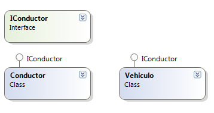

# Parte Ricardo

* [Principio de abierto/cerrado (OCP)](#OCP)
* [Principio de sustitución de Liskov (LSP)](#LSP)

# OCP

    
El Principio de Abierto-Cerrado, del inglés "The Open-Close Principle (OCP)", nos viene a decir que cualquier entidad software (clases, módulos, funciones, etc.) debe de estar abierta para ser extendida en funcionalidad pero cerrada para ser modificada. Es decir, una clase que cumpla con OCP tiene estas dos características:

    1.- La funcionalidad del módulo puede cambiarse o extenderse en base a los cambios que requiera el sistema.

    2.- Extender la funcionalidad de un módulo no implica cambios en el código fuente de ese módulo en sí mismo.

    

# LSP
lorem lorem lorem lorem lorem lorem lorem lorem lorem lorem lorem lorem lorem lorem lorem lorem lorem lorem lorem
lorem lorem lorem lorem lorem lorem lorem lorem lorem lorem lorem lorem lorem lorem lorem lorem lorem lorem lorem 
lorem lorem lorem lorem lorem lorem lorem lorem lorem lorem lorem lorem lorem lorem lorem lorem lorem lorem lorem
lorem lorem lorem lorem lorem lorem lorem lorem lorem lorem lorem lorem lorem lorem lorem lorem lorem lorem lorem 
lorem lorem lorem lorem lorem lorem lorem lorem lorem lorem lorem lorem lorem lorem lorem lorem lorem lorem lorem
lorem lorem lorem lorem lorem lorem lorem lorem lorem lorem lorem lorem lorem lorem lorem lorem lorem lorem lorem 
lorem lorem lorem lorem lorem lorem lorem lorem lorem lorem lorem lorem lorem lorem lorem lorem lorem lorem lorem
lorem lorem lorem lorem lorem lorem lorem lorem lorem lorem lorem lorem lorem lorem lorem lorem lorem lorem lorem 
lorem lorem lorem lorem lorem lorem lorem lorem lorem lorem lorem lorem lorem lorem lorem lorem lorem lorem lorem
lorem lorem lorem lorem lorem lorem lorem lorem lorem lorem lorem lorem lorem lorem lorem lorem lorem lorem lorem 
lorem lorem lorem lorem lorem lorem lorem lorem lorem lorem lorem lorem lorem lorem lorem lorem lorem lorem lorem
lorem lorem lorem lorem lorem lorem lorem lorem lorem lorem lorem lorem lorem lorem lorem lorem lorem lorem lorem 
lorem lorem lorem lorem lorem lorem lorem lorem lorem lorem lorem lorem lorem lorem lorem lorem lorem lorem lorem
lorem lorem lorem lorem lorem lorem lorem lorem lorem lorem lorem lorem lorem lorem lorem lorem lorem lorem lorem 
lorem lorem lorem lorem lorem lorem lorem lorem lorem lorem lorem lorem lorem lorem lorem lorem lorem lorem lorem
lorem lorem lorem lorem lorem lorem lorem lorem lorem lorem lorem lorem lorem lorem lorem lorem lorem lorem lorem 
lorem lorem lorem lorem lorem lorem lorem lorem lorem lorem lorem lorem lorem lorem lorem lorem lorem lorem lorem
lorem lorem lorem lorem lorem lorem lorem lorem lorem lorem lorem lorem lorem lorem lorem lorem lorem lorem lorem 
lorem lorem lorem lorem lorem lorem lorem lorem lorem lorem lorem lorem lorem lorem lorem lorem lorem lorem lorem
lorem lorem lorem lorem lorem lorem lorem lorem lorem lorem lorem lorem lorem lorem lorem lorem lorem lorem lorem 
lorem lorem lorem lorem lorem lorem lorem lorem lorem lorem lorem lorem lorem lorem lorem lorem lorem lorem lorem
lorem lorem lorem lorem lorem lorem lorem lorem lorem lorem lorem lorem lorem lorem lorem lorem lorem lorem lorem 
